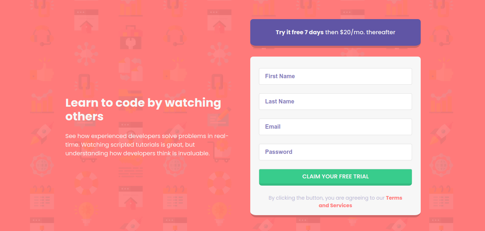

# Frontend Mentor - Intro component with sign up form solution

This is a solution to the [Intro component with sign up form challenge on Frontend Mentor](https://www.frontendmentor.io/challenges/intro-component-with-signup-form-5cf91bd49edda32581d28fd1). Frontend Mentor challenges help you improve your coding skills by building realistic projects.

## Table of contents

- [Overview](#overview)
  - [The challenge](#the-challenge)
  - [Screenshot](#screenshot)
  - [Links](#links)
- [My process](#my-process)
  - [Built with](#built-with)
  - [What I learned](#what-i-learned)
  - [Continued development](#continued-development)
  - [Useful resources](#useful-resources)
- [Author](#author)
- [Acknowledgments](#acknowledgments)

## Overview

### The challenge

Users should be able to:

- View the optimal layout for the site depending on their device's screen size
- See hover states for all interactive elements on the page
- Receive an error message when the `form` is submitted if:
  - Any `input` field is empty. The message for this error should say _"[Field Name] cannot be empty"_
  - The email address is not formatted correctly (i.e. a correct email address should have this structure: `name@host.tld`). The message for this error should say _"Looks like this is not an email"_

### Screenshot



### Links

- Solution URL: [GitHub Repository](https://github.com/jsalen/signup-component)
- Live Site URL: [GitHub Pages](https://jsalen.github.io/signup-component/src/)

## My process

### Built with

- Semantic HTML5 markup
- Sass Preprocessor
- Flexbox
- Mobile-first workflow
- Vanilla JavaScript

### What I learned

I put into practice what I learned about Sass, and even worked with modularized code of both CSS and JavaScript.

```html
<section class="intro">
  <h1 class="intro__title">Learn to code by watching others</h1>
  <p class="intro__description">...</p>
</section>
```

```css
.intro {
  ... &__title {
    ... @include font-size(32px);
    /* Even mixins, yay! */
    ...;
  }

  &__description {
    ...;
  }
}
```

```js
import validateEmail from "./components/validateEmail.js";
import showError from "./components/showError.js";
```

### Continued development

Although I feel pretty good with my code, I still need to practice more. What I liked the most about this little project was being able to put working with modular components into practice.

### Useful resources

- [Platzi.com](https://www.platzi.com) - Everything that I know, I owe to this great site. Its community and its teachers can bring the best out of you.

## Author

- LinkedIn - [Joseph Salen](https://www.linkedin.com/in/salenjs/)
- Frontend Mentor - [@jsalen](https://www.frontendmentor.io/profile/jsalen)
- Twitter - [@salenjs](https://www.twitter.com/salenjs)
